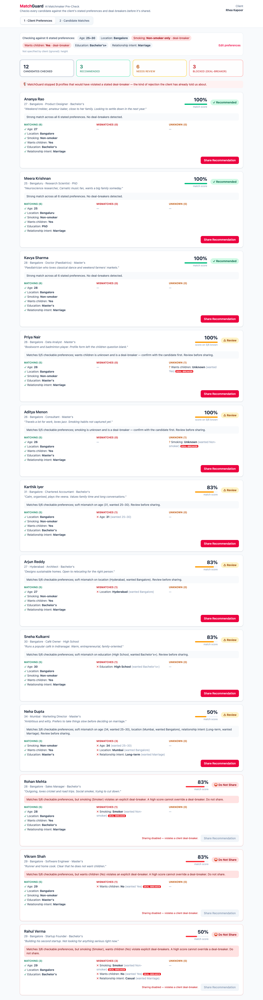
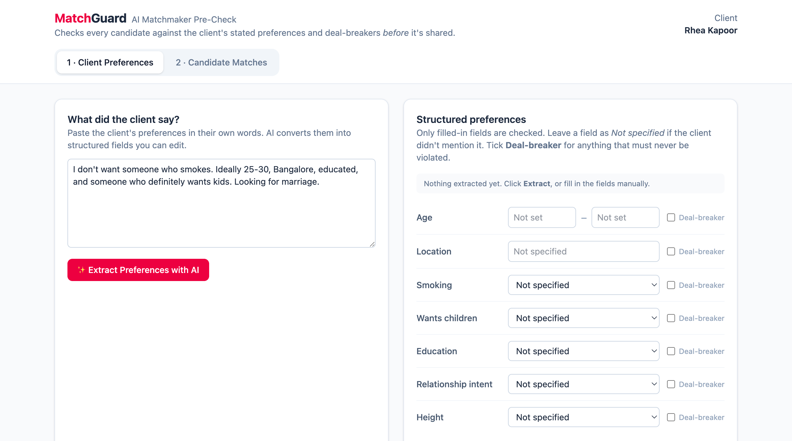
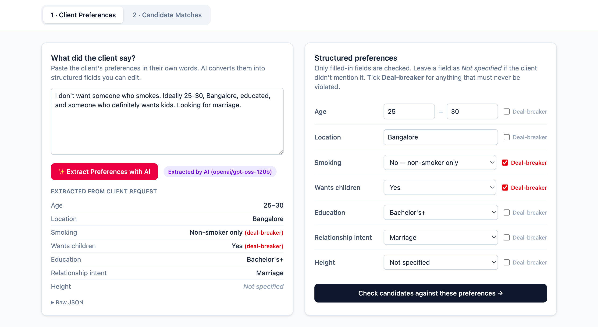
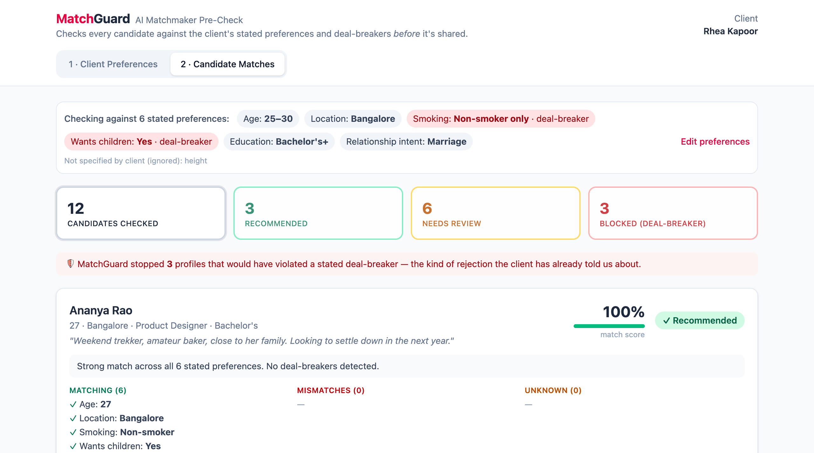

# MatchGuard — AI Matchmaker Pre-Check

**MatchGuard stops matchmakers from sending profiles that obviously break a client's stated preferences.**

Before a matchmaker shares a candidate, MatchGuard checks the candidate against the client's preferences and deal-breakers. It then ranks the candidates and gives each one a plain-English verdict: **Recommended**, **Review** or **Do Not Share**.



> Built for The Date Crew Product & Tech Generalist assessment. The written answers are in [ASSESSMENT.md](./ASSESSMENT.md).

## Prototype Screenshots

**1. Client preference input**



The matchmaker pastes what the client said in their own words. Structured fields start as *Not specified* until extraction runs.

**2. AI-extracted structured preferences**



Groq turns the text into editable fields and flags "definitely" and "don't want" as deal-breakers. Anything the client didn't mention stays *Not specified*.

**3. Candidate matching results**



The deterministic engine checks all 12 candidates against only the stated preferences: 3 recommended, 6 need review, and 3 are blocked by a deal-breaker.

## Quick start

Requirements: Node.js 20.19 or newer.

```bash
npm install        # installs root, server/ and client/ dependencies
npm run dev        # API on :3001, UI on http://localhost:5173
```

Open http://localhost:5173.

No API key is needed. Without one, MatchGuard falls back to a rule-based preference extractor.

### Optional: enable AI extraction

```bash
cp server/.env.example server/.env
# then edit server/.env and set GROQ_API_KEY=...   (free key: https://console.groq.com)
```

Restart `npm run dev`. The server log will say `extraction mode: AI (Groq)`, and the UI will label each extraction "Extracted by AI". Any OpenAI-compatible API also works if you set `GROQ_BASE_URL` and `GROQ_MODEL`.

> **Model:** the default is `openai/gpt-oss-120b`. The earlier default, `llama-3.3-70b-versatile`, is no longer offered by Groq. Override it with `GROQ_MODEL`.
>
> **Security:** the key is read only by the Express server (`server/.env`, which git ignores). It is never sent to the browser, and never logged or returned in API errors; error messages are redacted.
>
> **Testing:** the full flow (browser → API → live Groq → UI) was tested with a real key, including an invalid key and an unknown model. Unit tests cover the AI path with a mocked `fetch`: success, missing or invalid key, API errors, malformed output and network failure. If the AI call fails, the app uses rule-based extraction and shows the reason in the UI.

### Other commands

```bash
npm test           # match-engine + extractor unit tests (server)
npm run build      # type-check and build server + client
```

## How it works

```
Client's words ──(AI or rules)──► Structured preferences ──(matchmaker edits)──►
Deterministic match engine ──► Ranked, explained results ──► Matchmaker decides to share
```

| Part | Where | Notes |
|---|---|---|
| Preference extraction | `server/src/preferenceExtractor.ts` | Groq LLM using **Structured Outputs** (strict JSON Schema built from the existing TypeScript types, with plain JSON mode as a fallback for models without schema support), or regex rules if there is no key or the call fails. Both outputs pass through `sanitizePreferences()` and then `keepOnlyGrounded()`, which removes any value with no evidence in the client's words. |
| Match engine | `server/src/matchEngine.ts` | Pure functions with no AI, so results are explainable and testable. |
| API | `server/src/index.ts` | Three endpoints (below). |
| Mock data | `server/src/data/candidates.json` | 12 fictional candidates |
| UI | `client/src/` | React + Tailwind, 2 pages |

### Four distinct states

| State | Meaning | Effect |
|---|---|---|
| **Not specified** | The client didn't mention it (preference is `null`) | Ignored. Not checked, not scored. |
| **Unknown** | The client specified it, but the candidate's field is `null` | Listed separately, not scored, gives **Review** |
| **Mismatch** | Known, and it doesn't fit | Soft → **Review**; deal-breaker → **Do Not Share** |
| **Match** | Known, and it fits | Counts towards the score |

Subjective wishes such as "handsome" are shown to the matchmaker but never matched on, because there is no reliable candidate data for them. Height is a simple optional band (short / average / tall).

Every extraction starts from empty preferences, so values from a previous client can't carry over. Editing the client request after an extraction shows a warning until you extract again.

### Match rules

1. Each **stated** preference gets one of three results: **match**, **mismatch** or **unknown**.
2. **Score** = matches ÷ preferences we could check. Unknown fields are not counted in the score. They are listed separately and never treated as a mismatch.
3. Any **deal-breaker mismatch** gives **Do Not Share**, whatever the score. Sharing is disabled for these candidates.
4. Any soft mismatch or unknown gives **Review**. The matchmaker has to confirm the flags before sharing.
5. Everything else is **Recommended**. Results are ranked Recommended → Review → Do Not Share, then by score.

### API

| Method | Path | Body | Returns |
|---|---|---|---|
| GET | `/api/candidates` | — | `{ candidates }` |
| POST | `/api/preferences/extract` | `{ text }` | `{ preferences, source: "ai" \| "fallback", model?, warning? }` |
| POST | `/api/matches` | `{ preferences }` | `{ preferences, results, summary }` |

```bash
curl -s localhost:3001/api/preferences/extract -H 'Content-Type: application/json' \
  -d '{"text":"Ideally 25-30, Bangalore. Smoking is a deal-breaker. Definitely wants kids."}'
```

## Deliberately out of scope

This is a two-week, one-person scope, so it leaves out authentication, a database, Docker, a candidate search UI and learning from rejection feedback. Preferences live in React state and candidates in a JSON file.
